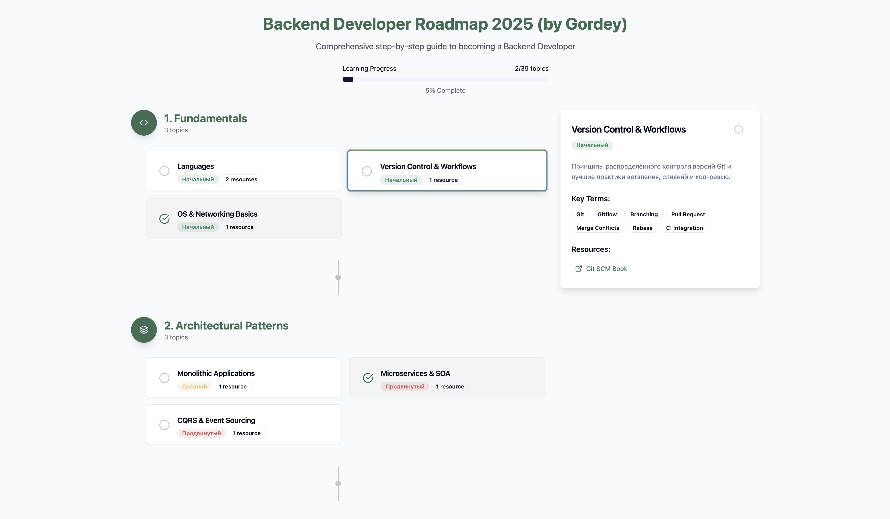

# Backend Roadmap UI

Интерактивный роадмап для изучения backend-разработки с визуализацией прогресса и ключевых тем.


## Скришоты:





## Что использовалось для создания?

### Содержимое `roadmap`'а.

Задано через подробный `prompt`:

```
You are an expert curriculum designer and technical writer. Your task is to generate a **static roadmap** for the IT-области **Backend Development**. Ответ должен быть в Markdown-структуре, включать:

1. **Основные разделы** (тема уровня 1).
2. **Подразделы** для каждого раздела (тема уровня 2).
3. Краткое **описание** (1–2 предложения) каждого раздела и подраздела.
4. Для каждого подраздела — список **ключевых слов** (5–7 штук) для дальнейшего поиска и маппинга со статьями.
5. Опционально: **рекомендуемые технологии**, инструменты или ресурсы (название + ссылка).

Требования к оформлению:
- Используй заголовки Markdown: `## Раздел`, `### Подраздел`.
- После описания подраздела оформляй ключевые слова в виде буллет-листа.
- Если доступны ссылки на официальную документацию или крупные статьи — добавляй в скобках.

Пример выходного формата:

markdown:
## 1. Архитектура серверной части
### 1.1 Паттерны проектирования
**Описание:** Обзор основных архитектурных паттернов в backend: MVC, MVVM, CQRS и др.  
**Ключевые слова:**
- MVC  
- MVVM  
- CQRS  
- Repository  
- Dependency Injection  
**Ресурсы:**
- [Martin Fowler – Patterns of Enterprise Application Architecture](https://martinfowler.com/eaa.html)
```

### Интерфейс

[v0.dev](https://v0.dev/) для создания интерфейса из текстовых запросов.

- Отправил полное содержание роадмапа.
- Указал стиль.
- Указал все цвета, что нужно использовать (7 цветов).
- Указал какие иконки брать.
- Для референса отправил прототип в фигма.


## Технологии

- **`React 18`** - основной фреймворк
- **`TypeScript`** - типизация
- **`Vite`** - сборщик и dev-сервер
- **`Tailwind CSS`** - стилизация
- **`Radix UI`** - компоненты (Progress)
- **`Lucide React`** - иконки
- **`shadcn/ui`** - UI компоненты (Card, Badge, Button)

## Запуск

### Установка зависимостей
```bash
npm install --legacy-peer-deps
```

### Запуск в режиме разработки
```bash
npm run dev
```

Приложение будет доступно по адресу: http://localhost:5173

## Структура проекта

```
UI/
├── components/ui/     # UI компоненты (shadcn/ui)
├── lib/              # Утилиты
├── roadmap.tsx       # Основной компонент роадмапа
├── main.jsx          # Точка входа
└── index.css         # Стили Tailwind
```

## Особенности

- Интерактивные карточки с темами
- Отслеживание прогресса изучения
- Адаптивный дизайн